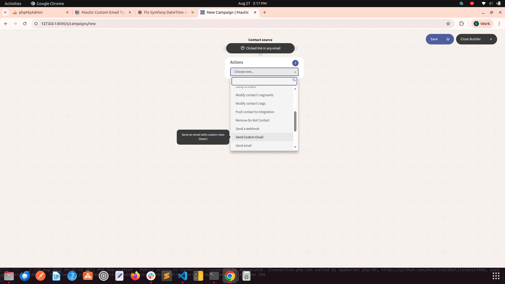
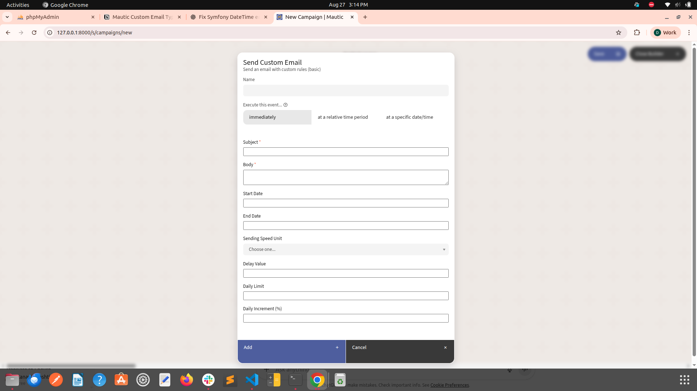
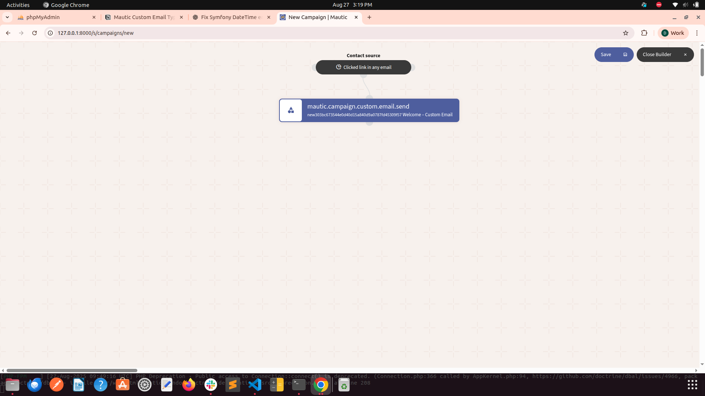

# Custom Email Plugin for Mautic

## 📌 Overview
This plugin adds a **Custom Email** action to Mautic Campaigns.  
It allows you to:
- Add a custom email type into campaigns
- Control sending speed (seconds/minutes delay between each send)
- Define daily sending limits
- Automatically increment daily limits by %
- Optionally set a start & end date
- Ensure only one send per contact (like segment emails)

---

## ⚙️ Installation

1. Copy the plugin folder into:
```bash
/plugins/CustomEmailBundle
```
2. Clear the cache:
```bash
php bin/console cache:clear
```
3. Go to Settings → Plugins in Mautic, and click Install/Upgrade Plugins.
You should see Custom Email plugin.

## ⚙️ Database Migration
The plugin uses an entity CustomEmail. Run these steps:

- Generate Migration
```bash
php bin/console doctrine:migrations:
```
- Run Migration
```bash
php bin/console doctrine:migrations:migrate
```
## Usage
Step 1: Create a Segment 
- Go to Segments → New Segment

- Import contacts via CSV (with at least email column)

- Example CSV:
```
email,firstname,lastname
john@example.com,John,Doe
jane@example.com,Jane,Smith
test1@gmail.com,Asha,Patel
```
Step 2: Create Campaign
- Go to Campaigns → New Campaign

- Select the Segment created above

- Add Action → Custom Email

Step 3: Configure Custom Email

Example configuration:
r site

- Body: Hi, thanks for joining our campaign.

- Start Date: 2025-08-14 09:00

- End Date: 2025-08-16 23:59

- Daily Limit: 200

- Daily Increment: 5

- Sending Speed Unit: Seconds

- Delay Value: 1

## Execution

Trigger Campaign
```
php bin/console mautic:segments:update
php bin/console mautic:campaigns:trigger
```
This will schedule the custom email events.

Verify Emails
- Go to Contacts → Select a Contact → Timeline
You should see:

    - “Email sent: Welcome to our site”

    - Or “Email scheduled” if waiting.

- Go to Emails section → Custom Email entry → Sent count should increase.

## References

- [Main Docs](https://docs.mautic.org/) 
- [Plugin Development Guide](https://developer.mautic.org/#plugins) 
- [Mautic GitHub](https://github.com/mautic/mautic) 

## Functionality Screenshot





